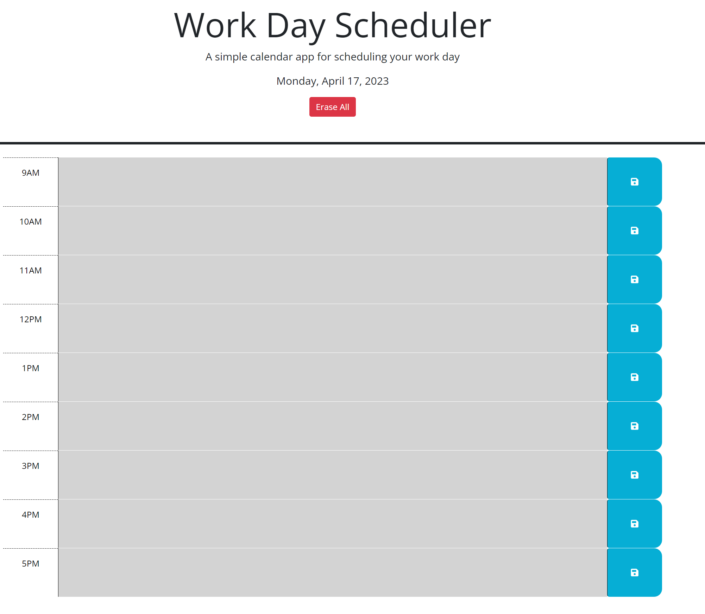

# Daily Planner

A simple daily planner application to help busy employees manage their time effectively by adding important events to a daily schedule. The planner displays time blocks for standard business hours and uses color-coding to indicate whether the time blocks are in the past, present, or future.

## Table of Contents

1. [Features](#features)
2. [Installation](#installation)
3. [Usage](#usage)
4. [Technologies Used](#technologies-used)
5. [Credits](#credits)

## Features

- Displays the current date at the top of the planner.
- Shows time blocks for standard business hours (9 AM to 5 PM).
- Color codes time blocks to indicate whether they are in the past (gray), present (red), or future (green).
- Allows users to enter events in the time blocks.
- Provides a save button for each time block to save the event text in local storage.
- Retains saved events upon page refresh.
- Includes an erase button to clear all saved events from local storage and the planner.

## Installation

1. Clone this repository to your local machine.

git clone https://github.com/jony0418/daily-planner.git

2. Open the `index.html` file in your preferred web browser.

## Usage

1. Click on a time block to enter an event.
2. Click the save button on the right side of the time block to save the event to local storage.
3. Refresh the page to see that your saved events persist.
4. Click the "Erase All" button at the top of the page to clear all saved events from local storage and the planner.

## Technologies Used

- HTML
- CSS
- JavaScript
- jQuery
- Day.js

## Credits

Developed by [Jonathan Becerra](https://github.com/jony0418).
